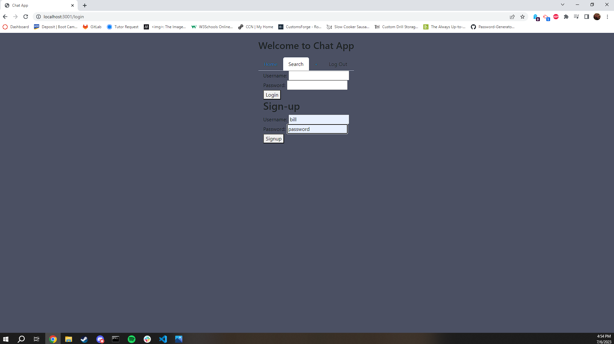
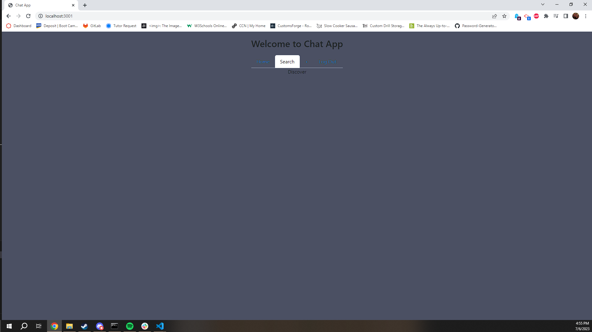
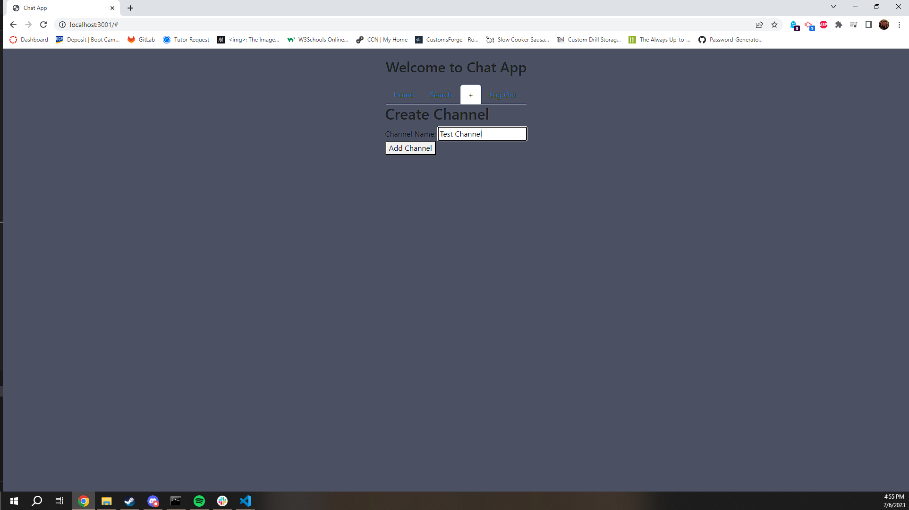
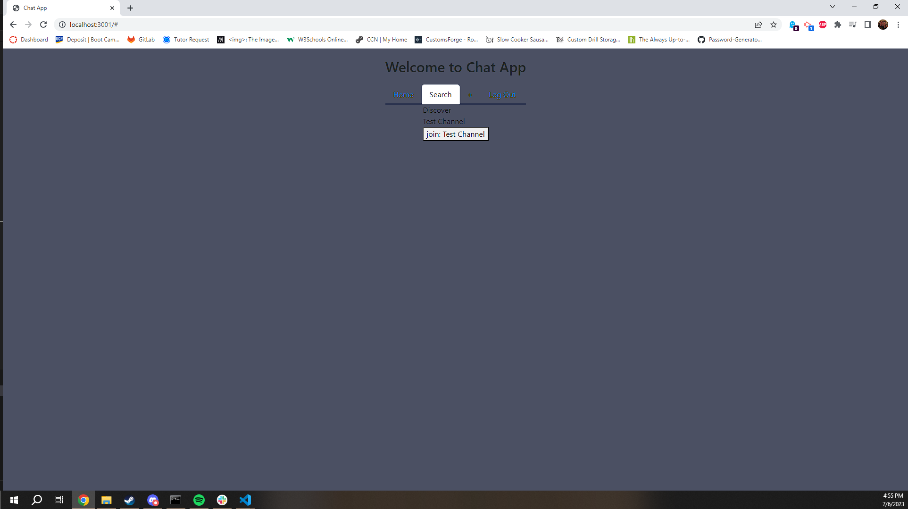
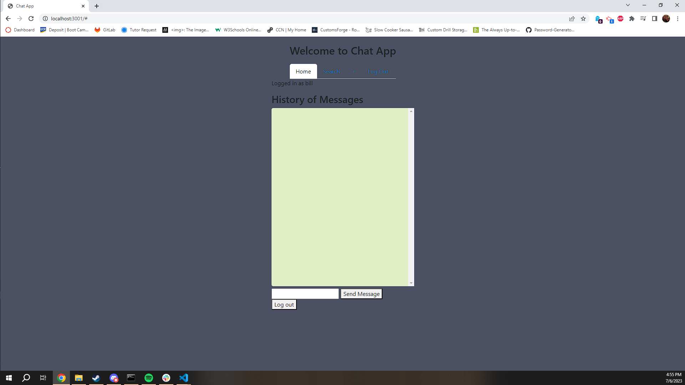

# Messaging App

## Table of Contents

- [Description](#description)
- [Installation](#installation)
- [Usage](#usage)
- [License](#license)
- [Contributing](#contributing)
- [Questions](#questions)

## Description

This application is a messaging application to communicate with friends. All it takes to use the app is a user name and a password, then you can create your own chat channel and type messages to anyone who has entered your channel.

View the screenshots below for a preview of the application

## Installation

1. Type npm i into the terminal to install all npm packages
2. Launch the server by typing node server.js in the terminal
3. Navigate to localhost:3001 to use the application

## Usage

1. Create a username and password that you will use to sign in whenever you use the application
2. Either create a channel or join an already existing channel
3. Type messages in the text box and send them to other people currently in your channel.

## License

MIT License

## Contributing

Lilia Hernandez
Cecil John
William Marks

## Questions

If you have any questions about the application refer to our email addresses and github accounts

Aden: https://github.com/NekoNoka adeneldredrewards2@gmail.com
Lilia: https://github.com/hdezlilia hdez.lilia56@gmail.com
Cecil: https://github.com/Cecilj24 clangba@yahoo.com
William: https://github.com/mrbll48 william.marks87@gmail.com
